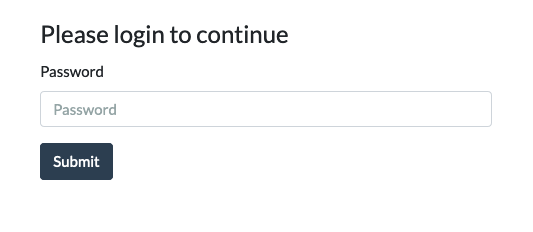
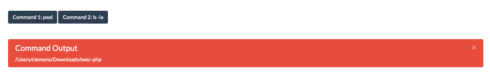

# php-shell_exec





```php
<?php
//only remove comment when you want to get the password hash
//echo password_hash("password", PASSWORD_ARGON2ID);
const PASSWORD = '';

session_start();

if (isset($_POST['pwField'])) if (password_verify($_POST['pwField'], PASSWORD)) $_SESSION['active'] = true;

if (isset($_SESSION['active']) && isset($_GET['execute'])) {
    $output = "";
    switch ($_GET['execute']) {
        case 1:
            $output = shell_exec("pwd");
            break;
        case 2:
            $output = shell_exec("ls -la");
            break;
        default: die("Missing Command");
    }
}
?>
<!DOCTYPE html>
<html lang="en">
<head>
    <meta charset="UTF-8">
    <title>Restricted Area</title>
    <link href="https://stackpath.bootstrapcdn.com/bootswatch/4.4.1/flatly/bootstrap.min.css" rel="stylesheet" crossorigin="anonymous">
    <style>
        body {
            margin: 5vw;
        }
        .alert {
            margin-top: 3vw;
        }
        form {
            width: 30vw;
        }
    </style>
</head>
<body>
<?php if (isset($_SESSION['active'])) { ?>
    <a type="submit" class="btn btn-primary" href="?execute=1">Command 1: pwd</a>
    <a type="submit" class="btn btn-primary" href="?execute=2">Command 2: ls -la</a>
    <?php if (isset($output)) { ?>
        <div class="alert alert-dismissible alert-danger">
            <button type="button" class="close" data-dismiss="alert">&times;</button>
            <h4 class="alert-heading">Command Output</h4>
            <div class="mb-0"><?php echo nl2br($output); ?></div>
        </div>
    <?php }
} else { ?>
    <form method="post">
        <fieldset>
            <legend>Please login to continue</legend>
            <div class="form-group">
                <label for="pwField">Password</label>
                <input type="password" class="form-control" id="pwField" name="pwField" placeholder="Password">
            </div>
            <button type="submit" class="btn btn-primary">Submit</button>
        </fieldset>
    </form>
<?php } ?>
</body>
</html>
